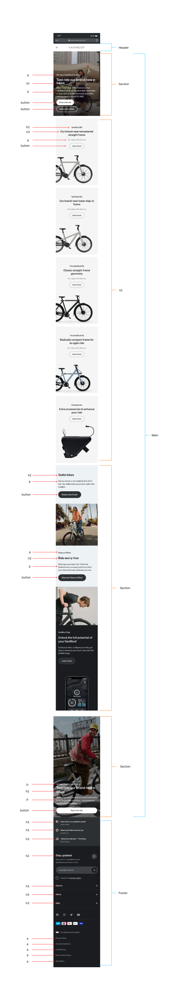
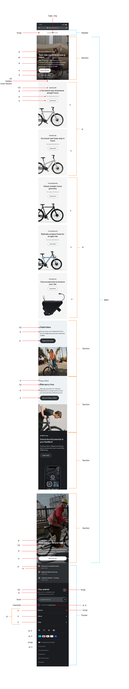

# Procesverslag
Markdown is een simpele manier om HTML te schrijven.  
Markdown cheat cheet: [Hulp bij het schrijven van Markdown](https://github.com/adam-p/markdown-here/wiki/Markdown-Cheatsheet).

Nb. De standaardstructuur en de spartaanse opmaak van de README.md zijn helemaal prima. Het gaat om de inhoud van je procesverslag. Besteedt de tijd voor pracht en praal aan je website.

Nb. Door *open* toe te voegen aan een *details* element kun je deze standaard open zetten. Fijn om dat steeds voor de relevante stuk(ken) te doen.

## Jij

  
uitwerken voor kick-off werkgroep

  ### Auteur:
  Giorgio Cheng

  #### Je startniveau:
  Blauw

  #### Je focus:
  Responsive
 

## Je website

  
uitwerken voor kick-off werkgroep

  ### Je opdracht:
  VANMOOF.nl - https://www.vanmoof.com/en-NL

  #### Screenshot(s) van de eerste pagina (small screen): 
  <b>Home pagina</b>  
  

  #### Screenshot(s) van de tweede pagina (small screen):
  <b>Model S5 pagina</b>  
  
 

## Toegankelijkheidstest 1/2 (week 1)

  
uitwerken na test in 1e werkgroep

  #### Screenreader
  www.vanmoof.com/nl getest:
  
  - Punt 1: Het valt me op dat als je op de Nederlandse pagina komt van Van Moof, er een engelse stem te horen is.
  
  - Punt 2: Wanneer je op de pagina komt, hoor je een de slogan, echter eindigt ie abrupt in het midden:
  
  

  - Punt 3: Wanneer je de bij "taal" bent, geeft de stem aan: "NL/NL" ipv, context wat je met deze button kan doen.
  
  

  - Punt 4: Idem dito voor "Myvanmoof", geen context weergeven wat je met deze button kan doen.
  
  - Punt 5: Als je naar de artikelen gaat, geeft de screenreader niet aan om welk product het gaat:
  
  
  
  - Punt 6: Idem dito, op het moment dat je op "ontdek meer" klikt, word er niet aangegeven op welke section je zit als gebruiker.
  
  #### Muis en Toetsenbord 
  De taps zijn over het algemeen wel logisch, echter slaat de screenreader hele blokken over zonder de context te vermelden waar je je bevindt als        gebruiker.

  #### Visueel (brillen, contrast, kleurenblind, dark/light). 
  Hier korte omschrijving (met indien nodig afbeeldingen)

  Hier een omschrijving van hoe het opgelost kan worden (met indien nodig afbeeldingen)

## Breakdownschets (week 1)

  
uitwerken na afloop 2e werkgroep

  ### de hele pagina: 
  

  ### de hele pagina v2 (na feedback van voortgang 1): 
  

## Voortgang 1 (week 2)

  
uitwerken voor 1e voortgang

  ### Stand van zaken
  Net begonnen met het bouwen van de HTML structuur.
  Ik wist nog niet helemaal goed hoe ik sommige elementen moest opbouwen met HTML.
  Vooral de blokken in het midden (de blokken onder de fietsen) zit ik nog over te twijfelen.

  ### Agenda voor meeting
  samen met je groepje opstellen

  Jesse:
  HTML code en breakdownschets
  
  Nathan: 
  HTML code
  
  Henriks:
  De vertaalslag van breakdownschets naar HTML
  
  Emilio:
  Breakdownschets
  
  Giorgio:
  Vertaalslag van breakdownschets naar HTML

  ### Verslag van meeting
  hier na afloop snel de uitkomsten van de meeting vastleggen

  - eerste HTML gaat goed
  - README bijhouden
  - Screenshots mobiel toevoegen
  - Wat tips met flexbox gebruiken gekregen

## Voortgang 2 (week 3)

  
uitwerken voor 2e voortgang

  ### Stand van zaken
  Ik ben verder gegaan met HTML, liep tegen een paar punten aan waardoor ik niet helemaal lekker door kon gaan.
  Vooral het responsive maken vind ik lastig. Maar gaat nu wel een stuk beter.
  De hero is een video, ik weet niet hoe ik deze het beste kan bouwen met HTML.
  Ik zie op internet veel position: absolute, maar ik weet niet of dit de beste manier is.

  ### Agenda voor meeting
  samen met je groepje opstellen

  Jesse:
  CSS + JS interactie bespreken
  
  Nathan: 
  Afwezig
  
  Giorgio:
  HTML en CSS bespreken, vooral het responsive maken van de code.
  
  Henriks:
  Over GRID en FLEXBOX, mbt responsiveness van bepaalde onderdelen.

  ### Verslag van meeting
  Voortgang ging goed ik was goed opweg. Heb een aantal dingen kunnen vragen zoals flex direction zodat een flex box voor een andere komt. Verder heb ik mee geluisterd met wat derest van het groepje te vertellen had en hoe hun bezig waren met hun html en css.

## Toegankelijkheidstest 2/2 (week 4)

  
uitwerken na test in 8e werkgroep

  ### Bevindingen
  Lijst met je bevindingen die in de test naar voren kwamen (geef ook aan wat er verbeterd is):

  #### Screenreader
  Hier korte omschrijving (met indien nodig afbeeldingen)

  Hier een omschrijving van hoe het opgelost kan worden (met indien nodig afbeeldingen)

  #### Muis en Toetsenbord 
  Hier korte omschrijving (met indien nodig afbeeldingen)

  Hier een omschrijving van hoe het opgelost kan worden (met indien nodig afbeeldingen)

  #### Motoriek (shocks, elastiekjes)
  Hier korte omschrijving (met indien nodig afbeeldingen)

  Hier een omschrijving van hoe het opgelost kan worden (met indien nodig afbeeldingen)

  #### Visueel (brillen, contrast, kleurenblind, dark/light). 
  Hier korte omschrijving (met indien nodig afbeeldingen)

  Hier een omschrijving van hoe het opgelost kan worden (met indien nodig afbeeldingen)

## Voortgang 3 (week 4)

  
uitwerken voor 3e voortgang

  ### Stand van zaken
  hier dit ging goed & dit was lastig (neem ook screenshots op van delen van je website en code)

  ### Agenda voor meeting
  samen met je groepje opstellen

  | student 1      | student 2          | student 3    | student 4        |
  | ---            | ---                | ---          | ---              |
  | dit bespreken  | en dit             | en ik dit    | en dan ik dat    |
  | en dat ook nog | dit als er tijd is | nog een punt | dit wil ik zeker |
  | ...            | ...                | ...          | ...              |

  ### Verslag van meeting
  hier na afloop snel de uitkomsten van de meeting vastleggen

  - punt 1
  - punt 2
  - nog een punt
  - ...

## Eindgesprek (week 5)

  
uitwerken voor eindgesprek

  ### Je uitkomst - karakteristiek screenshots:
  

  ### Dit ging goed/Heb ik geleerd: 
  Korte omschrijving met plaatjes

  

  ### Dit was lastig/Is niet gelukt:
  Korte omschrijving met plaatjes

  

## Bronnenlijst

  
continu bijhouden terwijl je werkt

  Nb. Wees specifiek ('css-tricks' als bron is bijv. niet specifiek genoeg).

  1. bron 1
  2. bron 2
  3. ...

